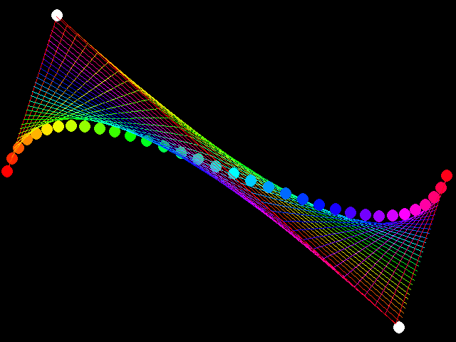
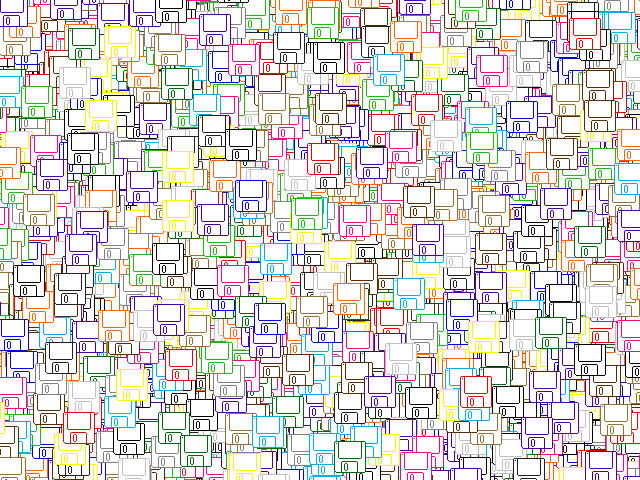
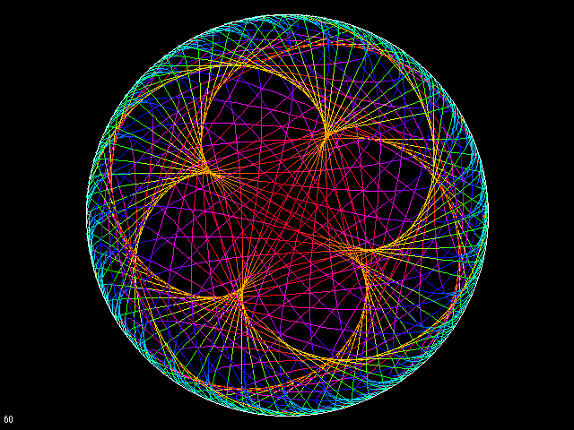
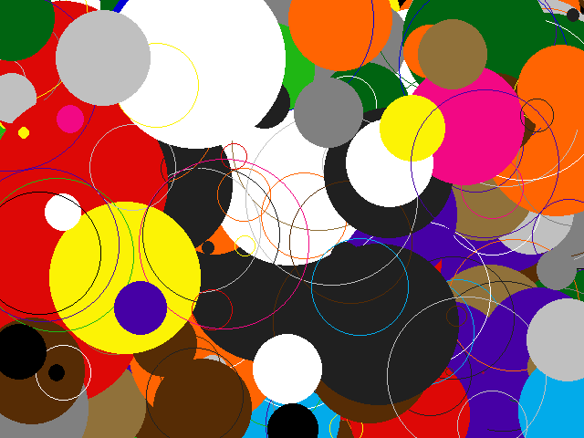
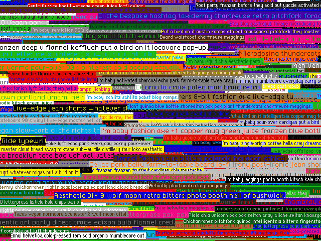
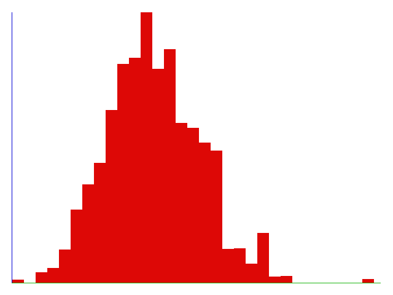
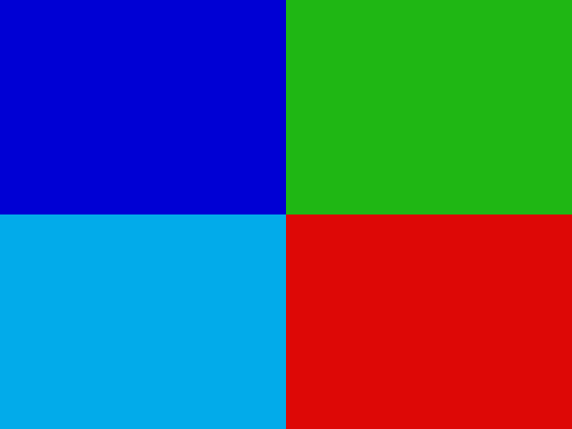
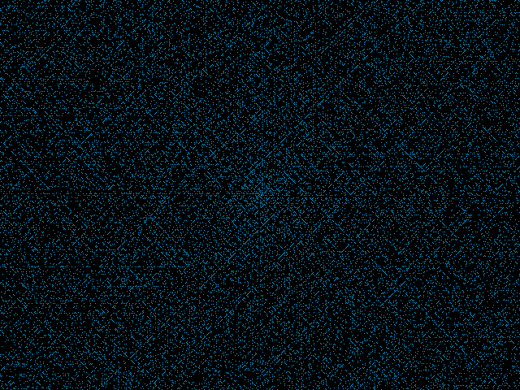
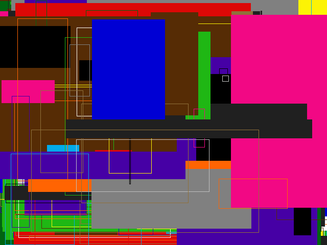
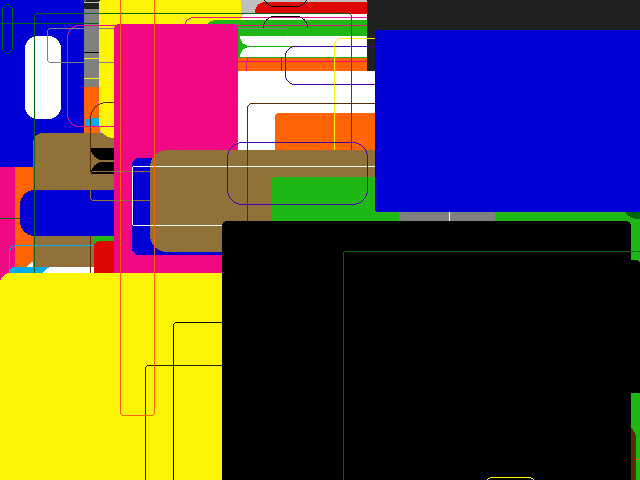

# Patater GUI Kit

## About

The Patater GUI Kit is a portable, open source GUI kit. It is a basic toolkit
for building a GUI. It also comes with a primitive 2D graphics library.

### Graphics Library Features

The Patater GUI Kit's graphics library supports the following graphics
operations:

- Filling the screen
- Drawing lines
- Drawing and filling rectangles
- Drawing and filling circles
- Drawing and filling rounded rectangles
- Loading 1bpp bitmaps from Windows BMP format
- Loading 4bpp bitmaps from Windows BMP format
- Blitting 1bpp bitmaps, with mask and op
- Blitting 4bpp bitmaps, with mask and op
- Rendering text with variable width bitmap fonts

The graphics library supports the following backends:

- Raw VGA (no SVGA) in 640x480 16 color mode
- SDL2, emulating VGA in 640x480 16 color mode
- SDL2, emulating VESA VBE 1.0 in 640x480 BGR555 (15-bit) color mode

### Demo Screenshots

The Patater GUI Kit includes a number of demo applications (see
[`apps/`](apps)). Here's what they look like.

### Other fun things inside

- 128-bit xorshift pseudo random number generator
- 64-bit FNV-1a hash
- 32-bit FNV-1a hash
- Linear probing hashmap
- `snprintf()` for C89 toolchains
- Handcrafted pixel icons

### Testing

The Patater GUI Kit is tested on the following platforms:

- FreeBSD
- FreeDOS with DJGPP

## Licensing

- The Patater GUI Kit Source Code is licensed as AGPL-3.0-or-later
- The Patater GUI Kit Icons are licensed as CC BY-SA 4.0
